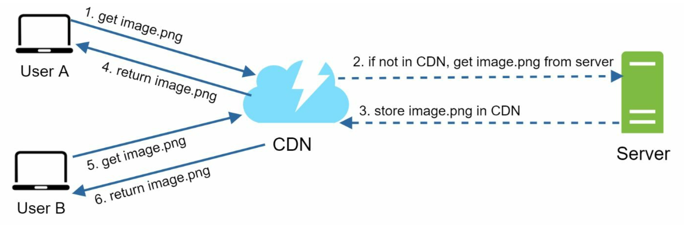

import { Aside } from 'astro-pure/user'

<Aside type="note">
From **System Design**, Alex Xu, Volumn 1
</Aside>

## What is CDN
A CDN is a network of geographically dispersed servers used to deliver static content. CDN
servers cache static content like images, videos, CSS, JavaScript files, etc.

Dynamic content caching is a relatively new concept and beyond the scope of this book. It
enables the caching of HTML pages that are based on request path, query strings, cookies,
and request headers. Refer to the article mentioned in reference material [^1] for more about
this. This book focuses on how to use CDN to cache static content.

## How CDN works
Here is how CDN works at the high-level: when a user visits a website, a CDN server closest
to the user will deliver static content. Intuitively, the further users are from CDN servers, the
slower the website loads. For example, if CDN servers are in San Francisco, users in Los
Angeles will get content faster than users in Europe. Figure below is a great example that shows
how CDN improves load time.

The figure below demonstrates the CDN workflow.

1. User A tries to get image.png by using an image URL. The URL’s domain is provided
by the CDN provider. The following two image URLs are samples used to demonstrate
what image URLs look like on Amazon and Akamai CDNs:

    * https://mysite.cloudfront.net/logo.jpg

    * https://mysite.akamai.com/image-manager/img/logo.jpg

2. If the CDN server does not have image.png in the cache, the CDN server requests the
file from the origin, which can be a web server or online storage like Amazon S3.
3. The origin returns image.png to the CDN server, which includes optional HTTP header
Time-to-Live (TTL) which describes how long the image is cached.
4. The CDN caches the image and returns it to User A. The image remains cached in the
CDN until the TTL expires.
5. User B sends a request to get the same image.
6. The image is returned from the cache as long as the TTL has not expired.

## Considerations of using a CDN

* **Cost**: CDNs are run by third-party providers, and you are charged for data transfers in
and out of the CDN. Caching infrequently used assets provides no significant benefits so
you should consider moving them out of the CDN.

* **Setting an appropriate cache expiry**: For time-sensitive content, setting a cache expiry
time is important. The cache expiry time should neither be too long nor too short. If it is
too long, the content might no longer be fresh. If it is too short, it can cause repeat
reloading of content from origin servers to the CDN.

* **CDN fallback**: You should consider how your website/application copes with CDN
failure. If there is a temporary CDN outage, clients should be able to detect the problem
and request resources from the origin.

* **Invalidating files**: You can remove a file from the CDN before it expires by performing
one of the following operations:

* **Invalidate the CDN object using APIs provided by CDN vendors**.

* **Use object versioning to serve a different version of the object**. To version an object,
you can add a parameter to the URL, such as a version number. For example, version
number 2 is added to the query string: `image.png?v=2`

[^1]: Amazon CloudFront Dynamic Content Delivery: https://aws.amazon.com/cloudfront/dynamic-content/
