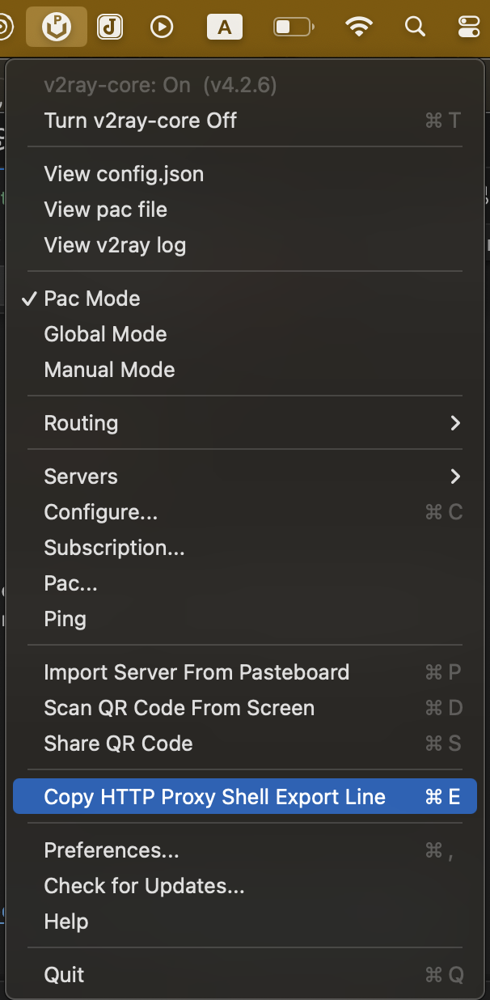

## Reason
Because Terminal or iTerm 2 does not use the system proxy, accessing GitHub, Google, Homebrew, etc. can sometimes be very slow and result in a poor user experience. It is best to configure them to use a proxy.

## Prerequisite
Proxy has been configured, such as V2RayU.

## How to Config Proxy for Terminal

### 1 prepare proxy command
such as,
```shell
export http_proxy=http://127.0.0.1:1087;export https_proxy=http://127.0.0.1:1087;export ALL_PROXY=socks5://127.0.0.1:1080
```



### 2 add to environment variable config 

```shell
vim ~/.zshrc
```
enter key `i` and then add proxy lines


### 3 apply new config

```shell
source ~/.zshrc
```

## Verify

```shell
curl -kv www.google.com
```

